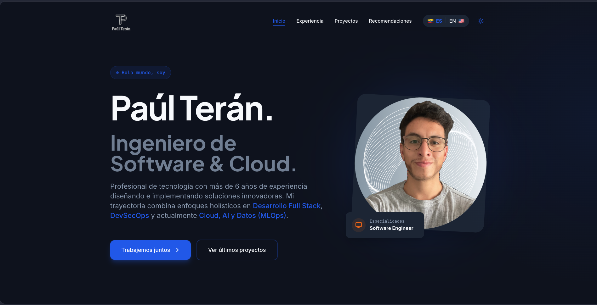
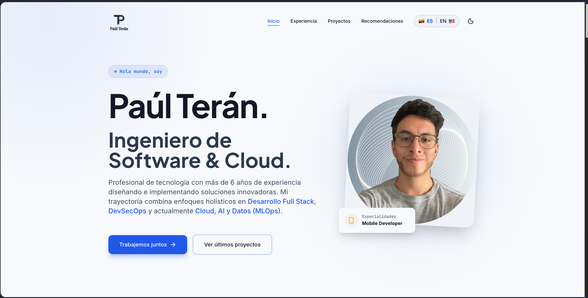

# Paúl Terán - Software & Cloud Engineer Portfolio

> Portafolio personal y profesional de Paúl Terán. Landing page moderna desarrollada en React + Tailwind CSS con soporte bilingüe, modo oscuro y optimización SEO, enfocada en Software Engineering y Arquitectura Cloud.

## 🌟 Previsualización

### Modo Oscuro


### Modo Claro


## 🚀 Tecnologías Principales

- **React + Vite:** Construcción ágil y carga extremadamente rápida como Single Page Application (SPA).
- **Tailwind CSS:** Diseño utilitario y responsivo aplicando estética moderna (Glassmorphism, gradientes personalizados y soporte nativo para Dark Mode).
- **Framer Motion:** Micro-animaciones fluidas vinculadas al scroll del usuario y al interactuar con los componentes.
- **Lucide React:** Iconografía minimalista y totalmente escalable.
- **EmailJS:** Integración para envío directo de formularios de contacto hacia el correo sin necesidad de gestionar un servidor backend propio.

## ✨ Características Destacadas

- **Soporte Bilingüe Nativo (ES | EN):** Integración customizada del motor de Google Translate, permitiendo traducir al instante todo el contenido manteniendo la fidelidad visual de la interfaz.
- **Optimización SEO y GEO:** Preparado meticulosamente para motores de búsqueda y modelos de IA, con metadatos específicos para indexación local (Quito, Ecuador), compatibilidad con Open Graph, Twitter Cards, `robots.txt` y Sitemap.
- **Modo Claro/Oscuro Integrado:** Botón interactivo superior con sistema de tokens de color armonizados.
- **Diseño Dinámico y Premium:** Tarjetas modales flotantes (como la sección "Sobre Mí"), botones Call-To-Action (CTA) dinámicos y scroll suave hacia anclas internas.

## 🛠️ Ejecución Local

Para correr este proyecto en tu entorno local:

1. Clona el repositorio:
   ```bash
   git clone https://github.com/Parterdev/paul-teran-portfolio.git
   ```
2. Ingresa al directorio del proyecto:
   ```bash
   cd paul-teran-portfolio
   ```
3. Instala las dependencias:
   ```bash
   npm install
   ```
4. Levanta el servidor de desarrollo:
   ```bash
   npm run dev
   ```

## 🌐 Contacto y Redes

- **Dominio Oficial:** [paul-teran.com](https://paul-teran.com/)
- **X (Twitter):** [@parterdev](https://x.com/parterdev)
- **LinkedIn:** [devpaulteran](https://www.linkedin.com/in/devpaulteran/)
- **Instagram:** [@parterdev](https://www.instagram.com/parterdev/)
- **GitHub:** [Parterdev](https://github.com/Parterdev)

---
Diseñado y construido con ❤️ por Paúl Terán.
